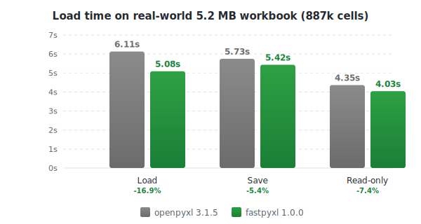

fastpyxl
========

A high-performance, statically typed drop-in replacement for
`openpyxl <https://pypi.org/project/openpyxl/>`_.

fastpyxl reads and writes Excel 2010+ xlsx/xlsm/xltx/xltm files with the same
API as openpyxl — just change your import:

.. code-block:: python

    # before
    from openpyxl import Workbook, load_workbook

    # after
    from fastpyxl import Workbook, load_workbook

No other code changes required.

Performance
-----------

Benchmarked on a real-world 5.2 MB IMF/World Bank workbook (887,370 cells,
97k formulas). Median of 5 runs, Python 3.12, openpyxl 3.1.5:

.. list-table::
   :header-rows: 1

   * - Operation
     - openpyxl
     - fastpyxl
     - Change
   * - Load workbook
     - 7.29s
     - 5.58s
     - **-23.5%**
   * - Save workbook
     - 5.70s
     - 5.74s
     - +0.6%
   * - Read-only iteration
     - 4.84s
     - 4.07s
     - **-15.9%**

Key optimizations since 1.0.0: inlined cell parsing, O(1) sheet lookup,
formula translation fast path, VBA archive filtering, empty-cell skip,
and cached sheet names. See the
`changelog <https://github.com/Promptly-Technologies-LLC/fastpyxl/releases>`_
for details.

Installation
------------

.. code-block:: bash

    pip install fastpyxl

Quick start
-----------

.. code-block:: python

    from fastpyxl import Workbook

    wb = Workbook()
    ws = wb.active

    ws["A1"] = 42
    ws.append([1, 2, 3])

    import datetime
    ws["A2"] = datetime.datetime.now()

    wb.save("sample.xlsx")

Key features
------------

- 1-to-1 API compatibility with openpyxl
- Static typing throughout
- Optimized cell parsing, coordinate lookups, and style deduplication
- Read-only and write-only modes for large files
- Charts, images, comments, data validation, pivot tables
- Conditional formatting and rich text
- Pandas DataFrame integration

Security
--------

By default fastpyxl does not guard against quadratic blowup or billion laughs
XML attacks. To guard against these attacks install
`defusedxml <https://pypi.org/project/defusedxml/>`_.

Documentation
-------------

Full documentation: https://fastpyxl.readthedocs.io

- `Tutorial <https://fastpyxl.readthedocs.io/en/stable/tutorial.html>`_
- `API reference <https://fastpyxl.readthedocs.io/en/stable/api/fastpyxl.html>`_
- `Release notes <https://fastpyxl.readthedocs.io/en/stable/changes.html>`_

Acknowledgements
----------------

fastpyxl is a fork of openpyxl. All credit to Eric Gazoni, Charlie Clark, and
the openpyxl contributors whose work this project builds upon.

License
-------

MIT. See `LICENSE <LICENSE>`_ for details.
